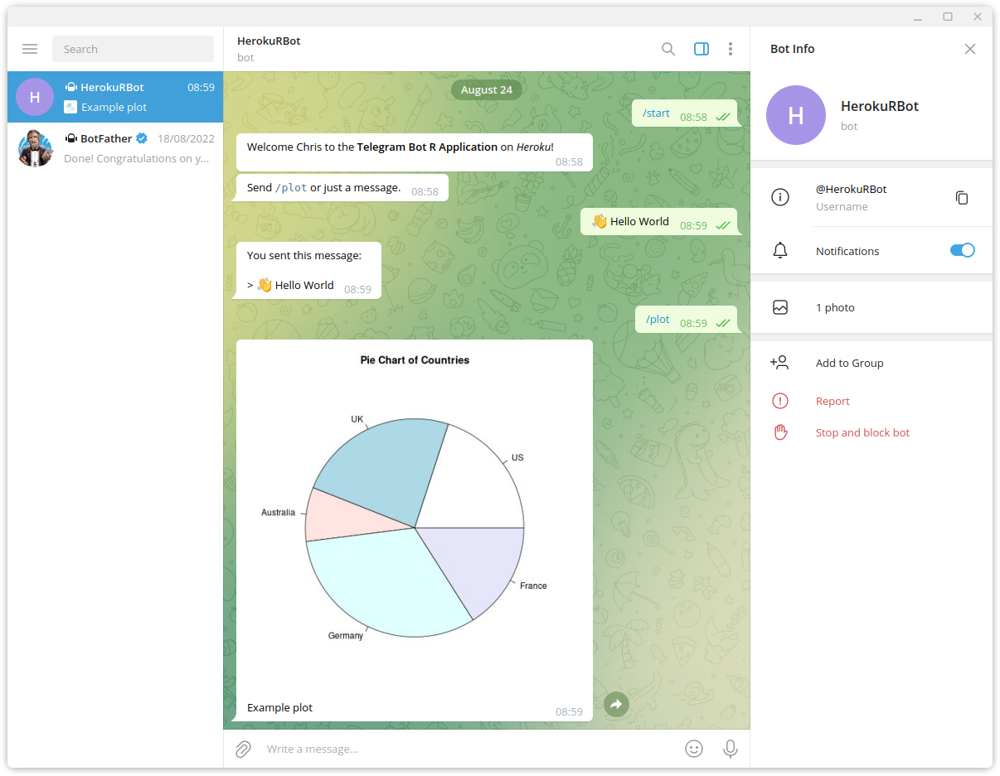

# Example Telegram Bot R Application on Heroku

This is an example [Telegram][telegram] Bot application, which uses
the [`telegram.bot`][telegram.bot] R package and [heroku-buildpack-r][buildpack] on Heroku.

You can use this project as a template for your applications.

## Usage

[![Deploy][button]][deployapp]

Execute these commands to get started:

* Clone the Project

  ```bash
  git clone https://github.com/virtualstaticvoid/heroku-telegram-bot-app.git
  ```

* Create Heroku Application

  From the project's directory, create the heroku application.

  ```bash
  heroku create --stack heroku-22 --buildpack vsv/heroku-buildpack-r
  ```

* Configure Telegram Access Token

  Obtain a [telegram bot token][token] and provide it via the `TELEGRAM_TOKEN` environment variable.

  I.e. Replace the following value `123456:ABC-DEF1234ghIkl-zyx57W2v1u123ew11` with your token.

  ```bash
  heroku config:set TELEGRAM_TOKEN=123456:ABC-DEF1234ghIkl-zyx57W2v1u123ew11
  ```

* Deploy Application

  ```bash
  git push heroku main
  ```

## Sending Messages

From your Telegram app, locate the Bot you created when obtaining the access token (above).

When you start the chat, the `/start` command will automatically be sent.

Any text message you send will be "echoed" back to you.

Finally, use the `/plot` command to receive an image containing a simple pie chart.



## Note

This application requires a least the [Hobby dyno type][hobby] to run, since it requires running a
long polling process to receive telegram messages.

## License

MIT License. Copyright (c) 2022 Chris Stefano. See [LICENSE](LICENSE) for details.

<!-- links -->

[buildpack]: https://github.com/virtualstaticvoid/heroku-buildpack-r
[button]: https://www.herokucdn.com/deploy/button.svg
[deployapp]: https://heroku.com/deploy?template=https://github.com/virtualstaticvoid/heroku-telegram-bot-poll/tree/main
[hobby]: https://devcenter.heroku.com/articles/dyno-types
[telegram.bot]: https://cran.r-project.org/web/packages/telegram.bot/
[telegram]: https://telegram.org/
[token]: https://github.com/ebeneditos/telegram.bot#generating-an-access-token
